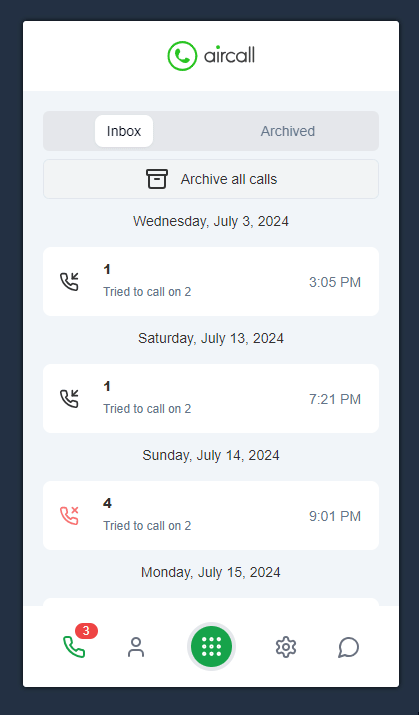

# Phone Call App

## Overview

This project was developed using React, Vite, React Query, React Router, Tailwind, shadcn/ui and Bun.
The project allows the user to see their activity on the phone calls. The user can also archive individual or all calls. The user can also reset all calls which unarchives all calls.
NOTE: The files in @/components/ui are components that were installed by shadcn/ui.

## Demo:



## Installation

```bash
bun install
```

## Usage

```bash
bun dev
```

## Build

```bash
bun run build
```
